# Web12Lab12

**Nama    : Aning Kinanti** <br>
**NIM     : 312010364** <br>
**Kelas   : TI.20.A2** <br>
**Matkul  : Pemrograman Web** <br>

# Framework (Codeigneter 4) Lanjutan CRUD
1. Buka kembali folder `lab11ci` pada htdocs
2. Jalankan xampp dan cli seperti pada penjelasan lab11web

## A. Program Sederhana CRUD Menggunakan CI4
### 1. Membuat Database 
Buat database terlebih dahulu dengan nama `lab_ci4` pada phpmyadmin, lalu buat table dengan nama `artikel` seperti dibawah ini : <br>
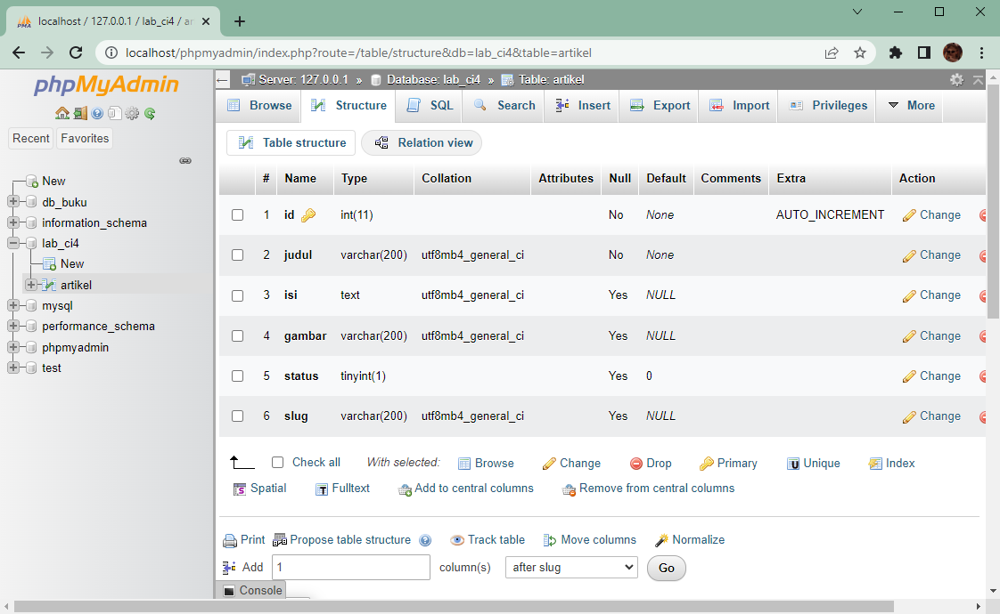 <br>
<br>

### 2. Konfigurasi Koneksi Database 
Selanjutnya membuat konfigurasi untuk menghubungkan dengan database server. Konfigurasi dapat dilakukan dengan dua cara yaitu pada file app/config/database.php atau menggunakan file .env. Pada kali ini kita gunakan konfigurasi pada file `.env` seperti dibawah ini : <br>
```
#--------------------------------------------------------------------
# DATABASE
#--------------------------------------------------------------------

database.default.hostname = localhost
database.default.database = lab_ci4
database.default.username = root
database.default.password = 
database.default.DBDriver = MySQLi
database.default.DBPrefix =
```
<br>

### 3. Membuat Model 
Kemudian buat Model untuk memproses data Artikel. Buat file baru pada direktori `app/Models` dengan nama `ArtikelModel.php`, lalu isi dengan sintaks seperti dibawah ini : <br>
```
<?php

namespace App\Models;

use CodeIgniter\Model;

class ArtikelModel extends Model
{
    protected $table = 'artikel';
    protected $primaryKey = 'id';
    protected $useAutoIncrement = true;
    protected $allowedFields = ['judul', 'isi', 'status', 'slug', 'gambar'];
}
```
<br>

### 4. Membuat Controller
Kemudian buat Controller baru pada direktori `app/Controllers` dengan nama `Artikel.php`, lalu isi dengan sintaks seperti dibawah ini : <br>
```
<?php

namespace App\Controllers;

use App\Models\ArtikelModel;

class Artikel extends BaseController
{
    public function index()
    {
        $title = 'Daftar Artikel';
        $model = new ArtikelModel();
        $artikel = $model->findAll();
        return view('artikel/index', compact('artikel', 'title'));
    }
}
```
<br>

### 5. Membuat View
Kemudian buat View baru pada direktori `app/Views/artikel` dengan nama `index.php`, lalu isi dengan sintaks seperti dibawah ini : <br>
```
<?= $this->include('template/header'); ?>

<?php if($artikel): 
    foreach($artikel as $row): ?>
    <article class="entry">
        <h2><a href="<?= base_url('/artikel/' . $row['slug']);?>"> <?= $row['judul']; ?></a></h2>
        " alt="<?= $row['judul']; ?>">
        <p><?= substr($row['isi'], 0, 500); ?></p>
    </article>

    <hr class="divider" />
<?php endforeach; 
else: ?>
    <article class="entry">
        <h2>Belum ada data.</h2>
    </article>
    <?php endif; ?>

<?= $this->include('template/footer'); ?>
```
<br>

Selanjutnya coba akses dengan alamat url http://localhost:8080/artikel , maka hasilnya akan menjadi seperti berikut : <br>
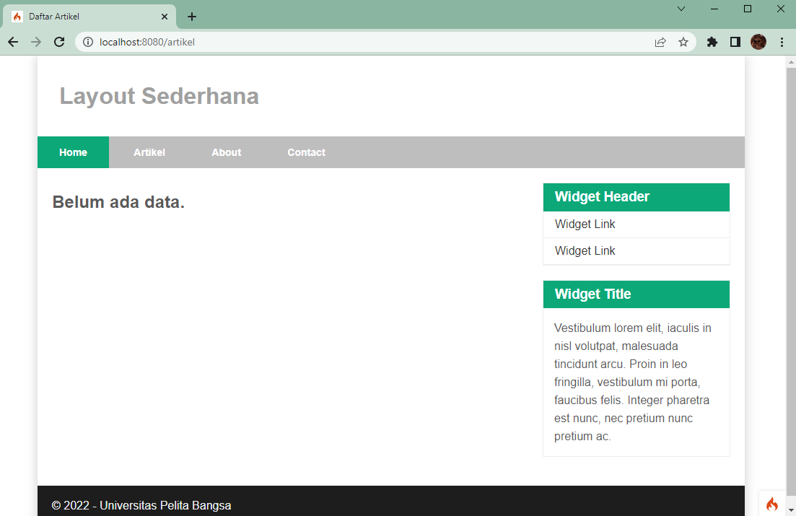 <br>

Belum ada data yang diampilkan. Kemudian coba tambahkan beberapa data pada database agar dapat ditampilkan datanya. Contoh tambahkan data seperti berikut : <br>
```
INSERT INTO artikel (judul, isi, slug) VALUE
('Artikel pertama', 'Lorem Ipsum adalah contoh teks atau dummy dalam industri 
percetakan dan penataan huruf atau typesetting. Lorem Ipsum telah menjadi 
standar contoh teks sejak tahun 1500an, saat seorang tukang cetak yang tidak 
dikenal mengambil sebuah kumpulan teks dan mengacaknya untuk menjadi sebuah 
buku contoh huruf.', 'artikel-pertama'), 
('Artikel kedua', 'Tidak seperti anggapan banyak orang, Lorem Ipsum bukanlah 
teks-teks yang diacak. Ia berakar dari sebuah naskah sastra latin klasik dari 
era 45 sebelum masehi, hingga bisa dipastikan usianya telah mencapai lebih 
dari 2000 tahun.', 'artikel-kedua');
```
<br>

Refresh browser dengan url http://localhost:8080/artikel , maka hasilnya akan menjadi seperti berikut : <br>
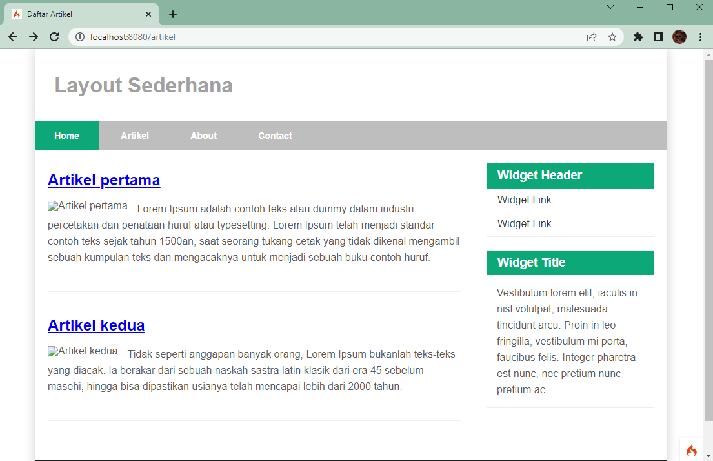 <br>

### 6. Membuat Controller Tampilan Detail Artikel
Tampilan pada saat judul berita di klik maka akan diarahkan ke halaman yang berbeda. 
Tambahkan fungsi baru pada Controller Artikel dengan nama view() , lalu tambahkan dengan sintaks seperti dibawah ini : <br>
```
    public function view($slug)
    {
        $model = new ArtikelModel();
        $artikel = $model->where([
            'slug' => $slug
        ])->first();

        // Menampilkan error apabila data tidak ada.
        if (!$artikel) 
        {
            throw PageNotFoundException::forPageNotFound();
        }

        $title = $artikel['judul'];
        return view('artikel/detail', compact('artikel', 'title'));
    }
```
<br>

### 7. Membuat View Detail 
Kemudian buat View baru untuk halaman detail pada direktori `app/Views/artikel` dengan nama `detail.php`, lalu isi dengan sintaks seperti dibawah ini :<br>
```
<?= $this->include('template/header'); ?>

<article class="entry">
    <h2><?= $artikel['judul']; ?></h2>
    " alt="<?= $artikel['judul']; ?>">
    <p>
        <?= $artikel['isi']; ?>
    </p>
</article>

<?= $this->include('template/footer'); ?>
```
<br>

### 8. Membuat Routing Untuk Artikel Detail
Buka Kembali file `app/config/Routes.php`, kemudian tambahkan routing untuk artikel 
detail dengan sintaks seperti dibawah ini :<br>
```
//route artikel
$routes->get('/artikel/(:any)', 'Artikel::view/$1');
```
<br>

Refresh browser dengan url http://localhost:8080/artikel lalu klik salah satu artikel, maka hasilnya akan menjadi seperti berikut : <br>
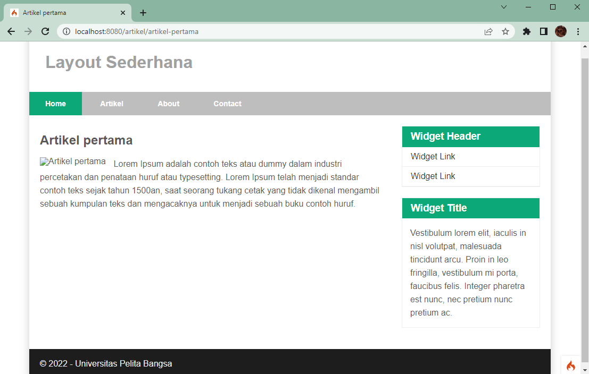 <br>
 <br>

### 9. Membuat Admin Header
Membuat file php pada `app/Views/artikel` dengan nama `admin_header.php`, lalu isi dengan sintaks seperti dibawah ini
:<br>
```
<!DOCTYPE html>
<html lang="en">
<head>
    <meta charset="UTF-8">
    <title><?= $title; ?></title>
    <link rel="stylesheet" href="<?= base_url('/artikel_style.css');?>">
</head>
<body>
    <div id="container">
    <header>
        <h1>Admin Portal Berita</h1>
    </header>
    <nav>
        <a href="<?= base_url('/');?>" class="active">Dashboard</a>
        <a href="<?= base_url('/admin/artikel');?>">Artikel</a>
        <a href="<?= base_url('/admin/artikel/add');?>">Tambah Artikel</a>      
    </nav>
    <section id="wrapper">
        <section id="main">
```
<br>

### 10. Membuat Admin Footer
Membuat file php pada `app/Views/artikel` dengan nama `admin_footer.php`, lalu isi dengan sintaks seperti dibawah ini
:<br>
```
        </section>
    </section>
    
        <footer>
            <p>&copy; 2022 - Universitas Pelita Bangsa</p>
        </footer>
    </div>
</body>
</html>   
```
<br>

Karna header footer baru telah dibuat pada langkah 9 dan 10, maka pada Views index dan detail ubah bagian <br>
```
<?= $this->include('template/header'); ?>

<?= $this->include('template/footer'); ?>
```
<br>

menjadi <br>
```
<?= $this->include('template/admin_header'); ?>

<?= $this->include('template/admin_footer'); ?>
```
<br>

### 11. Membuat Routing Untuk Menu Home
Buka Kembali file `app/config/Routes.php`, kemudian ubah routing untuk home dengan sintaks seperti dibawah ini :<br>
```
//route home
$routes->get('/', 'Artikel::admin_index');
```
<br>

### 12. Membuat Menu Admin
Menu admin adalah untuk proses CRUD data artikel. Buat method baru pada Controller Artikel dengan nama admin_index() , kemudian tambahkan dengan sintaks seperti dibawah ini :<br>
```
    public function admin_index()
    {
        $title = 'Daftar Artikel';
        $model = new ArtikelModel();
        $artikel = $model->findAll();
        return view('artikel/admin_index', compact('artikel', 'title'));
    }
```
<br>

### 13. Membuat View Admin
Kemudian buat View baru untuk halaman admin pada direktori `app/Views/artikel` dengan nama `admin_index.php`, lalu isi dengan sintaks seperti dibawah ini :<br>
```
<?= $this->include('template/admin_header'); ?>

<table class="table" id="customers">
    <thead>
        <tr>
            <th>ID</th>
            <th>Judul</th>
            <th>Status</th>
            <th>Aksi</th>
        </tr>
    </thead>
    <tbody>
    <?php if($artikel): foreach($artikel as $row): ?>
    <tr>
        <td><?= $row['id']; ?></td>
        <td>
            <b><?= $row['judul']; ?></b>
            <p><small><?= substr($row['isi'], 0, 50); ?></small></p>
        </td>
        <td><?= $row['status']; ?></td>
        <td>
            <a class="btn" id="ubah" href="<?= base_url('/admin/artikel/edit/' . $row['id']);?>">Ubah</a>
            <a class="btn" id="hapus" onclick="return confirm('Yakin menghapus data?');" href="<?= base_url('/admin/artikel/delete/' . $row['id']);?>">Hapus</a>
        </td>
    </tr>
    <?php endforeach; else: ?>
    <tr>
        <td colspan="4">Belum ada data.</td>
    </tr>
    <?php endif; ?>
    </tbody>
    <tfoot>
        <tr>
            <th>ID</th>
            <th>Judul</th>
            <th>Status</th>
            <th>Asksi</th>
        </tr>
    </tfoot>
</table>

<?= $this->include('template/admin_footer'); ?>
```
<br>

### 14. Membuat Routing Untuk Menu Admin
Buka Kembali file `app/config/Routes.php`, kemudian tambahkan routing untuk artikel 
detail dengan sintaks seperti dibawah ini :<br>
```
//route admin
$routes->group('admin', function($routes) 
{
    $routes->get('artikel', 'Artikel::index');
    $routes->add('artikel/add', 'Artikel::add');
    $routes->add('artikel/edit/(:any)', 'Artikel::edit/$1');
    $routes->get('artikel/delete/(:any)', 'Artikel::delete/$1');
});
```
<br>

Akses dengan alamat url http://localhost:8080/ , maka hasilnya akan menjadi seperti berikut : <br>
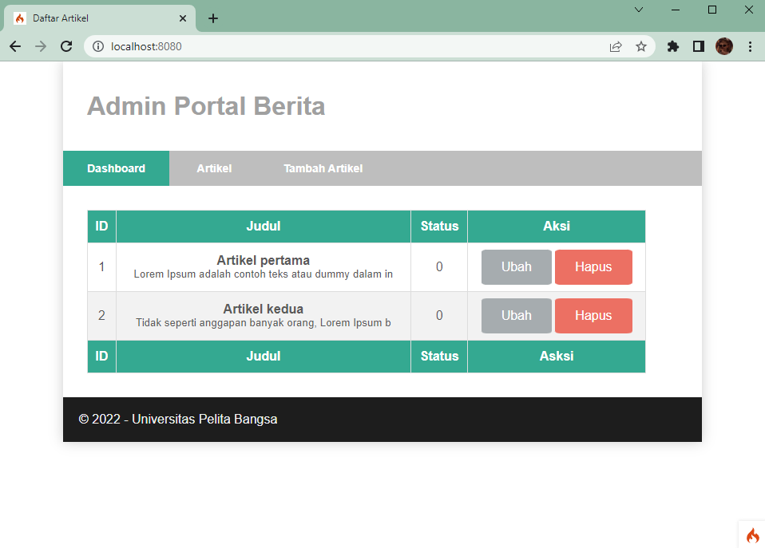 <br>

### 15. Membuat Controller Tambah Data Artikel
Tambahkan fungsi/method baru pada Controller Artikel dengan nama add() , tambahkan dengan sintaks seperti dibawah ini : <br>
```
    public function add()
    {
        // validasi data.
        $validation = \Config\Services::validation();
        $validation->setRules(['judul' => 'required']);
        $isDataValid = $validation->withRequest($this->request)->run();

        if ($isDataValid)
        {
            $artikel = new ArtikelModel();
            $artikel->insert([
                'judul' => $this->request->getPost('judul'),
                'isi' => $this->request->getPost('isi'),
                'slug' => url_title($this->request->getPost('judul')),
            ]);
            return redirect('admin/artikel');
        }
        $title = "Tambah Artikel";
        return view('artikel/form_add', compact('title'));
    }
```
<br>

### 16. Membuat View Form Add
Kemudian buat View baru untuk halaman admin pada direktori `app/Views/artikel` dengan nama `form_add.php`, lalu isi dengan sintaks seperti dibawah ini :<br>
```
<?= $this->include('template/admin_header'); ?>

<h2><?= $title; ?></h2>
<form action="" method="post">
    <p><input type="text" name="judul" class="judul"></p>
    <p><textarea name="isi" cols="50" class="textarea" rows="10"></textarea></p>
    <div>
        <button type="submit" value="Kirim" class="kirim">Kirim</button>
    </div>
</form>

<?= $this->include('template/admin_footer'); ?>
```
<br>

Klik menu tambah artikel pada halaman web sebelumnya atau akses dengan alamat url http://localhost:8080/admin/artikel/add , maka hasilnya akan menjadi seperti berikut : <br>
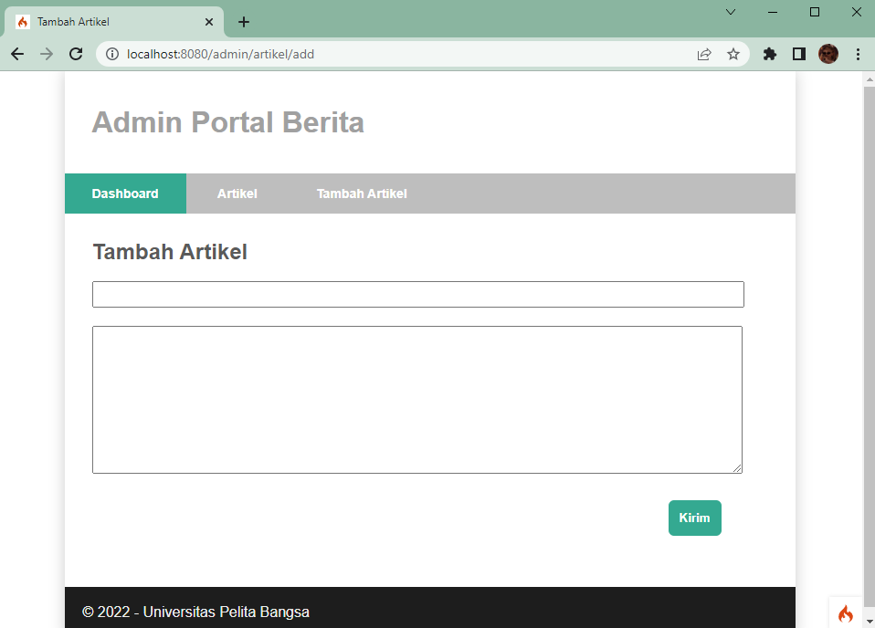 <br>

### 17. Membuat Controller Edit
Tambahkan fungsi/method baru pada Controller Artikel dengan nama edit() , tambahkan dengan sintaks seperti dibawah ini : <br>
```
    public function edit($id) 
    {
        $artikel = new ArtikelModel();

        // validasi data
        $validation = \Config\Services::validation();
        $validation->setRules(['judul' => 'required']);
        $isDataValid = $validation->withRequest($this->request)->run();

        if ($isDataValid)
        {
            $artikel->update($id, [
                'judul' => $this->request->getPost('judul'),
                'isi' => $this->request->getPost('isi'),
            ]);
            return redirect('admin/artikel');
        }

        // ambil data lama
        $data = $artikel->where('id', $id)->first();
        $title = "Edit Artikel";
        return view('artikel/form_edit', compact('title', 'data'));
    } 
```
<br>

### 18. Membuat View Untuk Edit
Kemudian buat View baru untuk halaman admin pada direktori `app/Views/artikel` dengan nama `form_edit.php`, lalu isi dengan sintaks seperti dibawah ini :<br>
```
<?= $this->include('template/admin_header'); ?>

<h2><?= $title; ?></h2>
<form action="" method="post">
    <p><input type="text" name="judul" class="judul" value="<?= $data['judul'];?>" ></p>
    <p><textarea name="isi" cols="50" class="textarea" rows="10"><?= $data['isi'];?></textarea></p>
    <div>
        <button type="submit" value="Kirim" class="kirim">Kirim</button>
    </div>
</form>

<?= $this->include('template/admin_footer'); ?>
```
<br>

Klik tombol ubah pada menu home/dashboard (pilih artikel yang akan diubah) pada halaman web sebelumnya , maka hasilnya akan menjadi seperti berikut : <br>
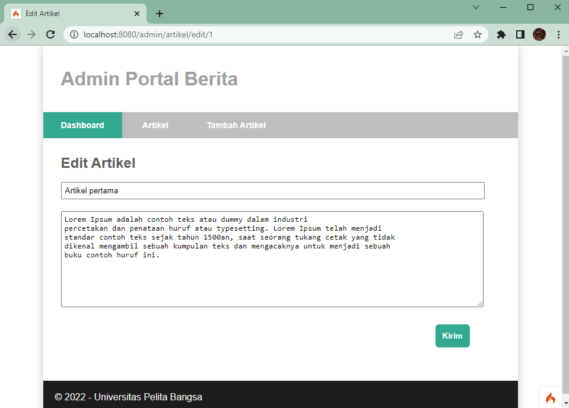 <br>

### 19. Membuat Controller Delete
Tambahkan fungsi/method baru pada Controller Artikel dengan nama delete(), tambahkan dengan sintaks seperti dibawah ini :<br>
```
    public function delete($id) 
    {
        $artikel = new ArtikelModel();
        $artikel->delete($id);
        return redirect('admin/artikel');
    }
```
### 20. File CSS
File css yang digunakan untuk program diatas yaitu file `artikel_style.css` yang disimpan pada folder Public.
<br>

POGRAM SELESAI DIBUAT.

## B. UJI COBA Program 
### 1. Fitur Add / Tambah Artikel
Mencoba menambahkan artikel dengan klik menu tambah artikel, lalu tambah artikel seperti dibawah ini : <br>
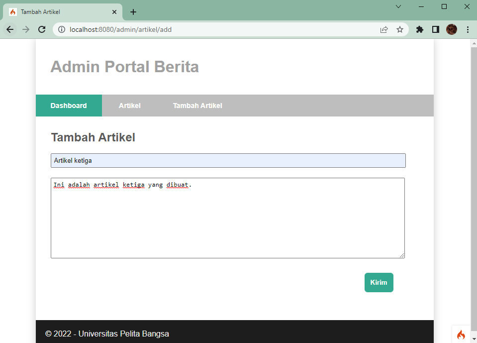 <br>

Lalu klik `Kirim`, maka data artikel baru akan ditambahkan dan muncul pada menu artikel dan menu dashboard seperti dibawah ini : <br>
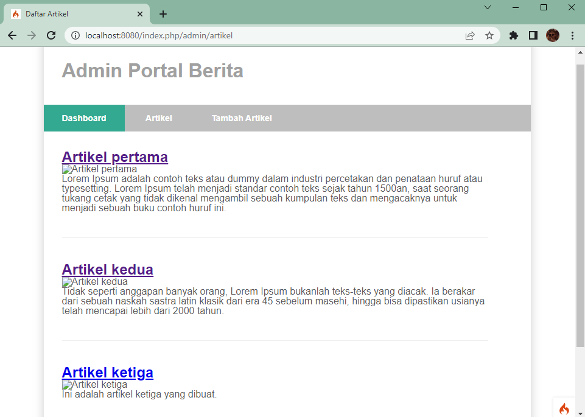 <br>
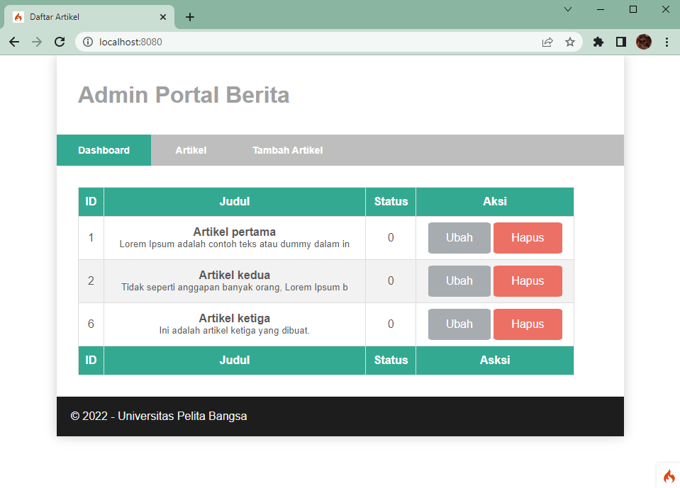 <br>

Mencoba menambahkan satu data baru lagi dengan judul artikel keempat, menjadi seperti berikut : <br>
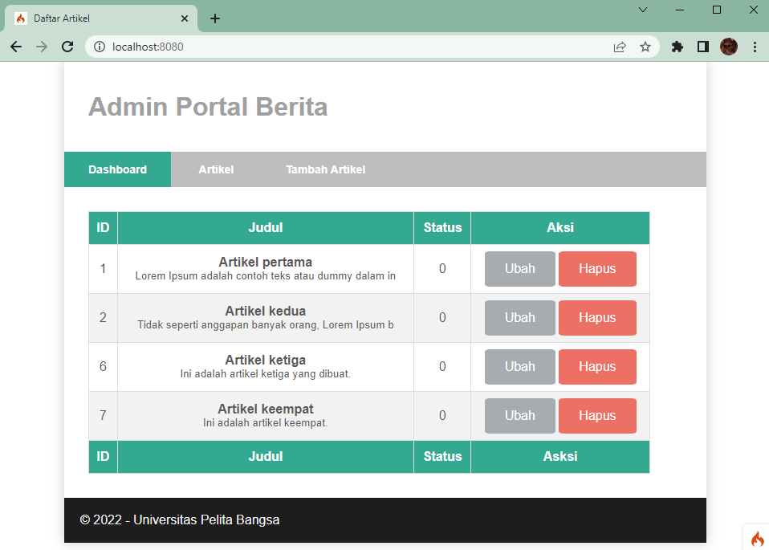 <br>

### 2. Fitur Edit/Ubah
Mencoba mengubah artikel dengan klik fitur Ubah pada artikel yang ingin diubah, seperti dibawah ini : <br>
Pilih artikel keempat, Lalu diubah pada bagian judul dan isinya dari `Artikel keempat` menjadi `Artikel kelima`. <br>
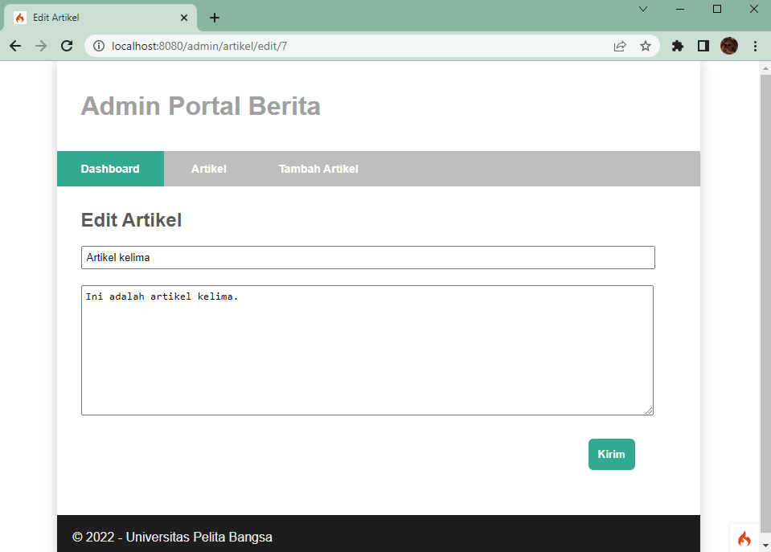 <br>

Lalu klik `Kirim`, maka data artikel akan terubah dan muncul pada menu artikel dan menu dashboard seperti dibawah ini : <br>
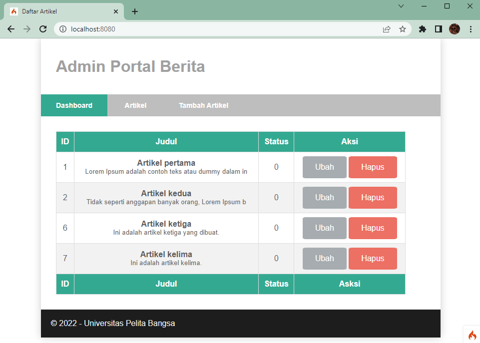 <br>

### 3. Fitur Delete/Hapus
Mencoba menghapus artikel dengan klik fitur Hapus seperti dibawah ini : <br>
Pilih artikel kelima, untuk dihapus dengan klik fitur hapus pada kolom aksi artikel kelima. <br>
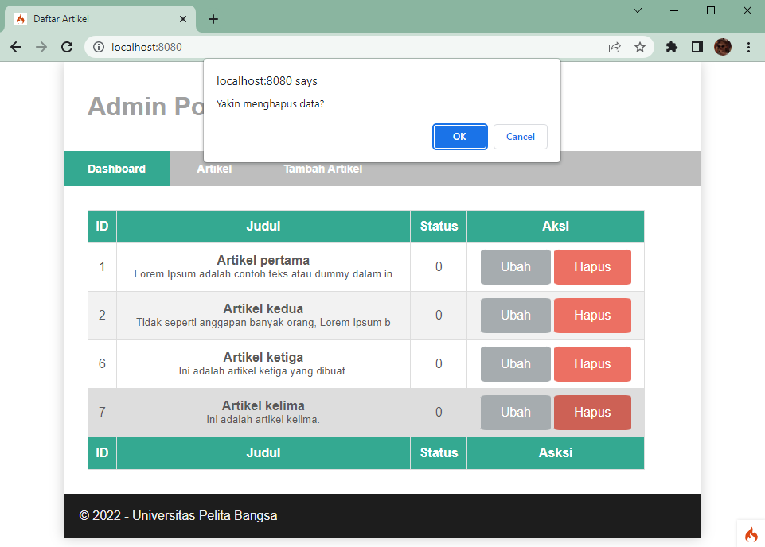 <br>

Klik OK pada alert yang muncul, maka data akan terhapus seperti berikut : <br>
 <br>